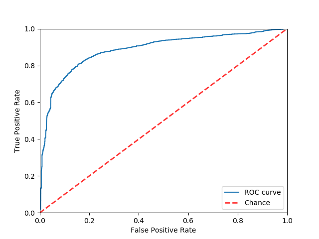
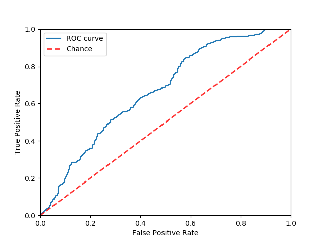
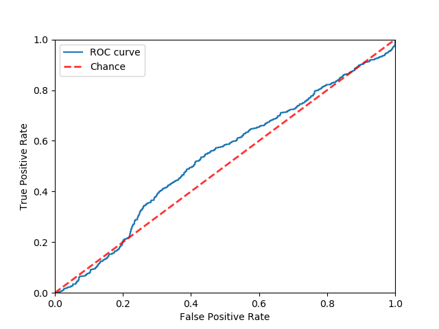
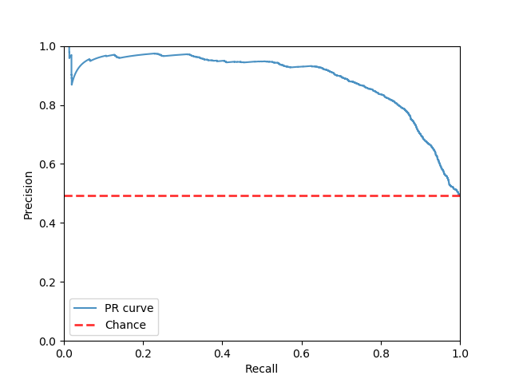
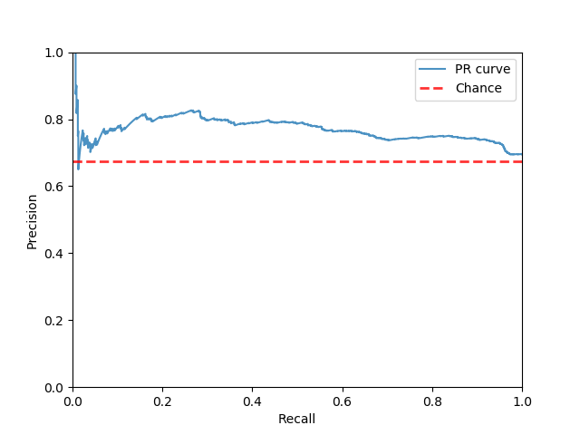
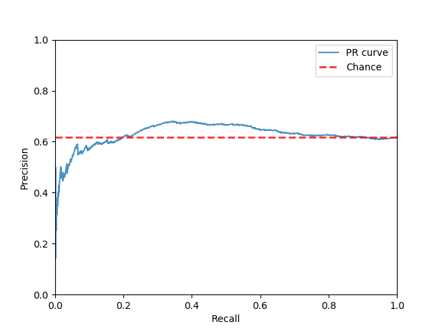

\thispagestyle{empty}
\newpage

# Introduction

In many fields of experimental science, the success rate of recent replication, reproduction and reinvestigation efforts has been lower than 50%.
Perhaps best known are large-scale collaborations such as the Reproducibility Project, which failed to replicate 62 out of 97 psychology papers [@reprod],
even though all original papers were widely-cited and published in esteemed journals.

Most replication efforts, however, are not part of such a collaboration. Because replication studies do not have a single defining characteristic, finding all published replications of a paper can prove to be difficult, be it automatically or manually.

If all replications of a given study could be automatically identified, checking the integrity of a paper's bibliography would become much easier. Another benefit would be that citation databases and academic search engines such as Google Scholar could include the replications of each paper on the result page, increasing their visibility. In this paper, exploratory research is performed to investigate whether any of this is possible. In particular, I look at whether replication studies can be distinguished from replicated studies and whether failed replications can be distinguished from successful replications.

Since replication studies typically cite the papers they replicate, replication searches can be limited to papers that cite the original paper. However, replication studies only account for a fraction of citations. As such, additional filtering is needed. One approach is to only query for documents that contain variants of the words "replication", "reproduction", "reanalysis" and "reinvestigation", but this does not even return half of all replication studies. Another problem with a simple rule-based system is that replication studies also cite papers they do not replicate.

Instead of constructing a rule-based system, a supervised text classification model could be trained to identify replication studies. This, however, requires a labeled dataset. Fortunately, the University of Göttingen's ReplicationWiki [@2017replicationwiki] has a collection of structured data concerning a hundreds of replication attempts spread over as many pages. The initial database was put together by students. According to a disclaimer on the website, the data may thus contain mistakes, but for a random sample of 50 papers all information appeared to be correct.

The ReplicationWiki also includes reproductions and reinvestigations in their definition of "replication", presumably because they can be equally interesting to those evaluating the trustworthiness of a study. For the sake of brevity, the same broad definition of "replication" is used throughout this paper.

Replication pages specify whether the attempt was successful, although this field is missing for 57% of the studies. This information will be used to train a classification model to distinguish between failed and successful replication attempts. Taking this idea even further, I will attempt to create a model that predicts from a paper's text content whether it is likely to replicate.

Determining which paper a replication study replicates is outside the scope of this exploratory paper, but the approach described below can be extended to include relational information.

# Methods

Replication metadata was scraped from the ReplicationWiki, including the title of the original paper, the title of the replication paper, whether the replication attempt was successful, whether different data was used for the replication, and whether new methods were used. The Crossref API was called to retrieve the DOI's of both the original papers and the replication studies. Using the DOI's, many of the papers could be downloaded directly. The other papers were downloaded manually. All papers were converted to text using the command-line tool `pdftotext`. Documents with less than 100 English words were discarded, leaving 334 replications and 344 original papers^[There are slightly more original papers than replications because some replication studies investigate multiple papers].

Fifty-dimensional word vectors trained on Wikipedia 2014 and Gigaword 5 were obtained from the [GloVe project page] [@pennington2014glove]. The low dimensionality was chosen because of the relatively small number of papers in the dataset. All words in all documents were mapped to their corresponding word vectors. Then, for each document, the average of all word vectors in that document was used as the document representation. Document-level hand-picked features were added on a per-task basis.

The model used in all tasks is a regularized logistic regression model (C = 1.0, class weights were balanced using the method devised by @king2001logistic).

## Task 1: Identifying Replications

Replication studies and replicated papers were annotated with positive and negative labels, respectively. For this task, the normalized frequencies of words starting with "replicat", "reproduc", "note", "comment", "reply", "re-" and "reinvestigat" were independently added as features. Additionally, both the average word vectors and the hand-picked features were recomputed for the paper titles rather than the full text, and this second feature matrix was concatenated to the first one. A logistic regression model was trained and tested on a stratified 40-fold split of the data.

## Task 2: Categorizing Replications

Replication studies were annotated with a label denoting whether the study failed. Partially successful and ambiguous replications were discarded, as were replications where data about the outcome was missing, leaving 150 replications, of which 49 were successful. A logistic regression model was trained and tested on a stratified 20-fold split of the data.

## Task 3: Predicting Failure to Replicate

All original papers were annotated with a label denoting whether its replications failed. Papers with mixed or partially successful replications were discarded, as were original papers where all replication results were missing, leaving 178 original papers, of which 68 were successfully replicated. A logistic regression model was trained and tested on a stratified 20-fold split of the data.

# Results

{#roc_identify width=33%}
{#roc_categorize width=33%}
{#roc_predict width=33%}

*Figure 1: ROC curves for the three tasks: identification (AUC = 0.886), categorization (AUC = 0.664), and prediction (AUC = 0.543). Red lines indicate chance.*

{#pr_identify width=33%}
{#pr_categorize width=33%}
{#pr_predict width=33%}

*Figure 2: Precision-recall curves for the three tasks: identification (AUC = 0.890, chance = 0.493), categorization (AUC = 0.76, chance = 0.67), and prediction (AUC = 0.637, chance = 0.618). Red lines indicate chance.*

As reasonably expected, predicting whether a paper fails to replicate based on its contents is the most challenging task, followed by categorizing failed and successful replication papers. The highest performance is achieved on identification of replication papers.

<!-- {#pr} -->

# Discussion

Performance on all tasks is lower than necessary for most fully automated use cases. The small dataset is likely one of the main culprits. Future work could gather data from sources other than the ReplicationWiki.

To keep the design simple, replicated papers were used as the non-replication papers the replication studies had to be distinguished from in the first task. In most use cases, however, replication papers have to be distinguished from other papers that cite the replicated paper. Although replicated papers may not be entirely similar to the set of papers that cite replicated papers, the results on the identification task at the very least showed that replication studies are distinguishable from other papers.

Since the ReplicationWiki was initially constructed by students, there may be some selection bias present. For example, students may opt to only include replications they consider interesting in the database. As such, future work could look at evaluating the classifiers on specialized, unbiased test sets constructed for specific use cases.

[GloVe project page]: https://nlp.stanford.edu/projects/glove/

# Bibliography
